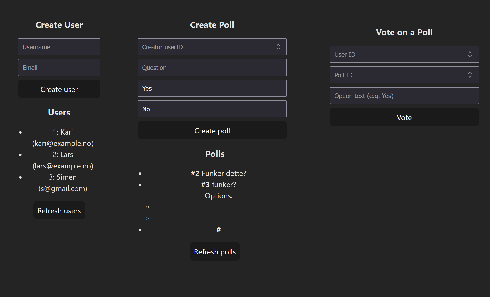

<h2> Experiment Assignment 3</h2>

### The things I did
- Worked on missing parts from the previous assignment
  - Added Pollcontroller
  - Added methods to create and delete options
  - Added methods to create, change and delete votes 
  - Added http test 6-12
- Added frontend part
  - Created necessary files
  - Added simple code to app.svelte to create a user and create a poll
- 
### What I still need to do
- Automate testing
- Fully integrate frontend and backend
- The functionality of the webpage is lacking, there are several functions that are missing

### Technical issues
- Spring boot would not run
  - Files locked while gradle tries to delete things
    - Paused oneDrive sync (would have moved all my files out of OneDrive, but i am already having enough cd issues, so would rather fix that another time)
    - manually deleted files 
    - ./gradlew clean build --no-daemon
- Nothing updated when runnning npm dev for the first time.
  - Added API base to have full URL

