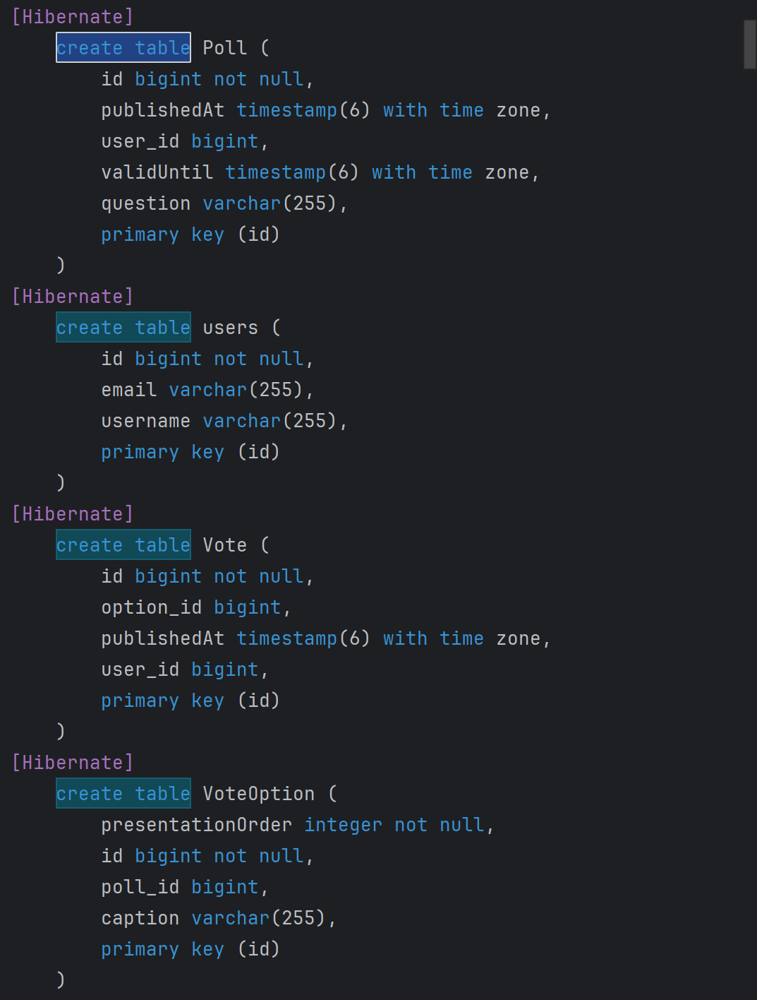

<h2> Experiment Assignment 4</h2>

### The things I did
- Added dependencies to gradle and removed spring boot starter
- Created the [PollsTest.java](https://github.com/SimenAB/DAT250_Expass_3/blob/Expass_4/expass1_spring_boot/src/test/java/no/hvl/dat250/jpa/polls/PollsTest.java) file and copied in test code
- Added necessary constructors and methods (for example in [User.java](https://github.com/SimenAB/DAT250_Expass_3/blob/Expass_4/expass1_spring_boot/src/main/java/no/hvl/dat250/pollapp/domain/User.java))
- Annotated domain classes with @Entity, @ManyToOne and @OneToMany
- Changed table name to match test
- To inspect the database tables I found the necessary settings [here](https://docs.jboss.org/hibernate/orm/7.0/introduction/html_single/Hibernate_Introduction.html#logging-generated-sql) under '2.8. Logging the generated SQL'
  - hibernate.show_sql
  - hibernate.format_sql
  - hibernate.highlight_sql
    - Added them to the PollsTest.java EntityManagerFactory
  - Ran the test, searched for 'create table'

### What I still need to do
- Clean up the code

### Technical issues
- Got many errors when adding "public user in user.java"
- Had to change imports
- Alot of trial and error to fix everything with 'MappedBy' and '@ManyToOne'
- Removed Jackson, caused errors
- had to make all list iterations non-final
- Ran into same file locking issues as in earlier assignment, disabled onedrive, removed daemons, manually deleted files, -- clean

