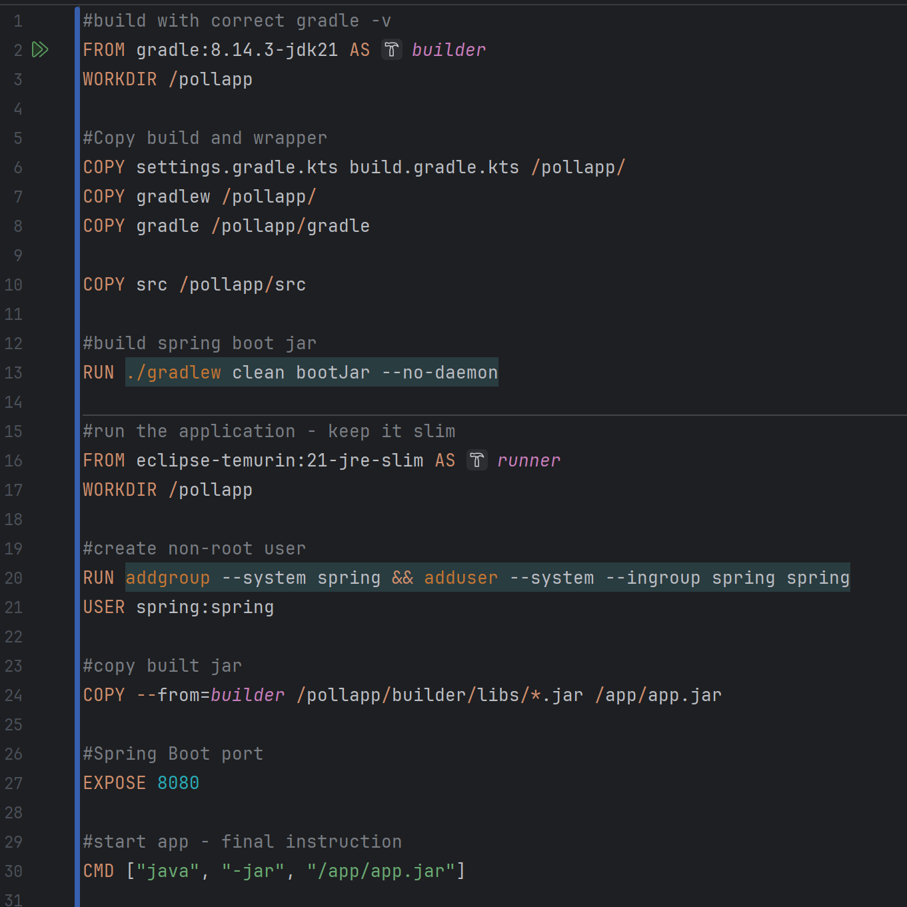

<h2> Experiment Assignment 6</h2>

### The things I did
 - created Dockerfile in root folder
   - Used multistage as recommended
   - Used image that matched dependencies
     
 - created .dockerignore file to avoid unecessary files in Docker 
 - ran the container from terminal 

### What I still need to do
 - Some additions to fulfill functionalities 
 - Optional extensions
 - clean up code, test everything again 

### Technical issues
- reoccurring issue with rebuilding gradle
- could not find Dockerfile despite being in the correct directory 
  - ERROR: failed to build: failed to solve: failed to read dockerfile: open Dockerfile: no such file or directory